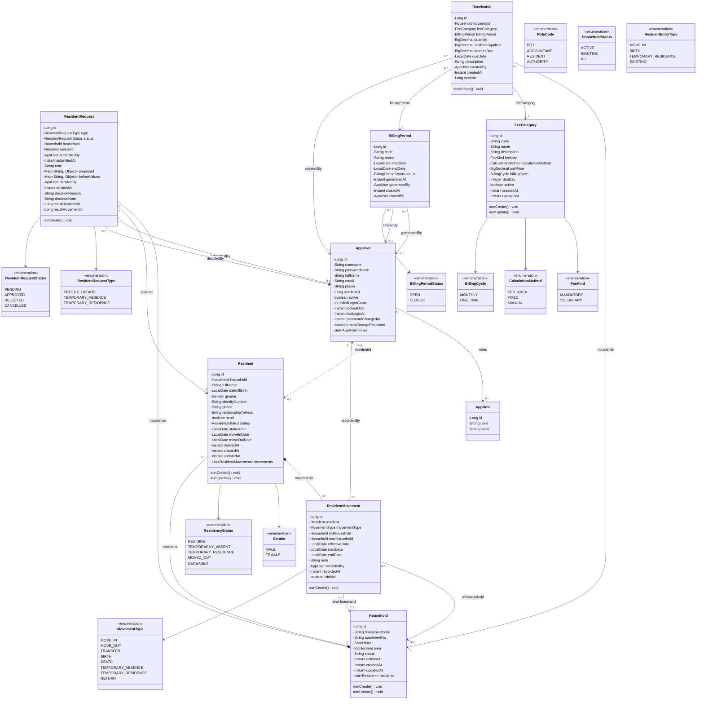

## 3. Class Diagram

### 3.1 Domain Entities & Enums 

```mermaid
classDiagram
    class AppRole {
        -Long id
        -String code
        -String name
    }

    class AppUser {
        -Long id
        -String username
        -String passwordHash
        -String fullName
        -String email
        -String phone
        -Long residentId
        -boolean active
        -int failedLoginCount
        -Instant lockedUntil
        -Instant lastLoginAt
        -Instant passwordChangedAt
        -boolean mustChangePassword
        -Set~AppRole~ roles
    }

    class Household {
        -Long id
        -String householdCode
        -String apartmentNo
        -Short floor
        -BigDecimal area
        -String status
        -Instant deletedAt
        -Instant createdAt
        -Instant updatedAt
        -List~Resident~ residents
        #onCreate() void
        #onUpdate() void
    }

    class Resident {
        -Long id
        -Household household
        -String fullName
        -LocalDate dateOfBirth
        -Gender gender
        -String identityNumber
        -String phone
        -String relationshipToHead
        -boolean head
        -ResidencyStatus status
        -LocalDate statusUntil
        -LocalDate moveInDate
        -LocalDate moveOutDate
        -Instant deletedAt
        -Instant createdAt
        -Instant updatedAt
        -List~ResidentMovement~ movements
        #onCreate() void
        #onUpdate() void
    }

    class ResidentMovement {
        -Long id
        -Resident resident
        -MovementType movementType
        -Household oldHousehold
        -Household newHousehold
        -LocalDate effectiveDate
        -LocalDate startDate
        -LocalDate endDate
        -String note
        -AppUser recordedBy
        -Instant recordedAt
        -boolean isInitial
        #onCreate() void
    }

    class ResidentRequest {
        -Long id
        -ResidentRequestType type
        -ResidentRequestStatus status
        -Household household
        -Resident resident
        -AppUser submittedBy
        -Instant submittedAt
        -String note
        -Map~String, Object~ proposed
        -Map~String, Object~ beforeValues
        -AppUser decidedBy
        -Instant decidedAt
        -String decisionReason
        -String decisionNote
        -Long resultResidentId
        -Long resultMovementId
        ~onCreate() void
    }

    class FeeCategory {
        -Long id
        -String code
        -String name
        -String description
        -FeeKind feeKind
        -CalculationMethod calculationMethod
        -BigDecimal unitPrice
        -BillingCycle billingCycle
        -Integer dueDay
        -boolean active
        -Instant createdAt
        -Instant updatedAt
        #onCreate() void
        #onUpdate() void
    }

    class BillingPeriod {
        -Long id
        -String code
        -String name
        -LocalDate startDate
        -LocalDate endDate
        -BillingPeriodStatus status
        -Instant generatedAt
        -AppUser generatedBy
        -Instant closedAt
        -AppUser closedBy
    }

    class Receivable {
        -Long id
        -Household household
        -FeeCategory feeCategory
        -BillingPeriod billingPeriod
        -BigDecimal quantity
        -BigDecimal unitPriceApplied
        -BigDecimal amountDue
        -LocalDate dueDate
        -String description
        -AppUser createdBy
        -Instant createdAt
        -Long version
        #onCreate() void
    }

    class RoleCode {
        <<enumeration>>
        BQT
        ACCOUNTANT
        RESIDENT
        AUTHORITY
    }

    class Gender {
        <<enumeration>>
        MALE
        FEMALE
    }

    class HouseholdStatus {
        <<enumeration>>
        ACTIVE
        INACTIVE
        ALL
    }

    class ResidencyStatus {
        <<enumeration>>
        RESIDING
        TEMPORARILY_ABSENT
        TEMPORARY_RESIDENCE
        MOVED_OUT
        DECEASED
    }

    class ResidentEntryType {
        <<enumeration>>
        MOVE_IN
        BIRTH
        TEMPORARY_RESIDENCE
        EXISTING
    }

    class MovementType {
        <<enumeration>>
        MOVE_IN
        MOVE_OUT
        TRANSFER
        BIRTH
        DEATH
        TEMPORARY_ABSENCE
        TEMPORARY_RESIDENCE
        RETURN
    }

    class ResidentRequestType {
        <<enumeration>>
        PROFILE_UPDATE
        TEMPORARY_ABSENCE
        TEMPORARY_RESIDENCE
    }

    class ResidentRequestStatus {
        <<enumeration>>
        PENDING
        APPROVED
        REJECTED
        CANCELLED
    }

    class FeeKind {
        <<enumeration>>
        MANDATORY
        VOLUNTARY
    }

    class CalculationMethod {
        <<enumeration>>
        PER_AREA
        FIXED
        MANUAL
    }

    class BillingCycle {
        <<enumeration>>
        MONTHLY
        ONE_TIME
    }

    class BillingPeriodStatus {
        <<enumeration>>
        OPEN
        CLOSED
    }

    AppUser "0..*" --> "0..*" AppRole : roles
    AppUser "0..1" ..> "0..1" Resident : residentId
    Household "1" *-- "0..*" Resident : residents
    Resident "1" *-- "0..*" ResidentMovement : movements
    ResidentMovement "0..*" --> "0..1" Household : oldHousehold
    ResidentMovement "0..*" --> "0..1" Household : newHousehold
    ResidentMovement "0..*" --> "1" AppUser : recordedBy
    ResidentRequest "0..*" --> "1" Household : household
    ResidentRequest "0..*" --> "0..1" Resident : resident
    ResidentRequest "0..*" --> "1" AppUser : submittedBy
    ResidentRequest "0..*" --> "0..1" AppUser : decidedBy
    BillingPeriod "0..*" --> "0..1" AppUser : generatedBy
    BillingPeriod "0..*" --> "0..1" AppUser : closedBy
    Receivable "0..*" --> "1" Household : household
    Receivable "0..*" --> "1" FeeCategory : feeCategory
    Receivable "0..*" --> "1" BillingPeriod : billingPeriod
    Receivable "0..*" --> "0..1" AppUser : createdBy

    Resident --> Gender
    Resident --> ResidencyStatus
    ResidentMovement --> MovementType
    ResidentRequest --> ResidentRequestType
    ResidentRequest --> ResidentRequestStatus
    FeeCategory --> FeeKind
    FeeCategory --> CalculationMethod
    FeeCategory --> BillingCycle
    BillingPeriod --> BillingPeriodStatus
```

### 3.2 Controller & Service Layer 

```mermaid
classDiagram
    class AuthController {
        +login(LoginRequest) LoginResponse
        +logout() Void
    }
    class UserController {
        +createUser(CreateUserRequest) UserResponse
        +getUsers(keyword, role, active, page, size) PageResponse~UserResponse~
        +getUserById(id) UserResponse
        +updateUserRoles(id, UpdateUserRolesRequest) UserResponse
        +updateUserStatus(id, UpdateUserStatusRequest) UserResponse
        +resetPassword(id, ResetPasswordRequest) PasswordResetResponse
    }
    class RoleController {
        +getRoles() List~RoleResponse~
    }
    class MeController {
        +getMe() UserResponse
        +getMyHousehold(currentUser) MyHouseholdResponse
        +updateProfile(UpdateProfileRequest) UserResponse
        +changePassword(ChangePasswordRequest) Void
    }
    class HouseholdController {
        +createHousehold(CreateHouseholdRequest, currentUser) HouseholdResponse
        +getHouseholds(keyword, status, page, size) PageResponse
        +getHouseholdById(id) HouseholdDetailResponse
        +updateHousehold(id, UpdateHouseholdRequest) HouseholdResponse
        +changeHouseholdHead(id, ChangeHouseholdHeadRequest) HouseholdResponse
        +updateHouseholdStatus(id, UpdateHouseholdStatusRequest) HouseholdResponse
    }
    class ResidentController {
        +createResident(id, CreateResidentRequest, currentUser) ResidentResponse
        +getResidents(id, status) List~ResidentInHouseholdResponse~
        +searchResidents(keyword, householdId, status, statusExpired, page, size) PageResponse~ResidentResponse~
        +getResidentById(id) ResidentResponse
        +updateResident(id, UpdateResidentRequest) ResidentResponse
        +deleteResident(id) Void
        +recordMovement(id, CreateMovementRequest, currentUser) RecordMovementResponse
        +getMovements(id) List~MovementResponse~
    }
    class SearchController {
        +search(keyword, type, limit) SearchResponse
    }
    class ResidentRequestController {
        +submitRequest(SubmitResidentRequest, currentUser) ResidentRequestResponse
        +listMyRequests(status, type, page, size, currentUser) PageResponse~ResidentRequestResponse~
        +getMyRequest(id, currentUser) ResidentRequestResponse
        +cancelMyRequest(id, currentUser) ResidentRequestResponse
        +listAllRequests(status, type, householdId, keyword, page, size) PageResponse~ResidentRequestResponse~
        +getRequestById(id) ResidentRequestResponse
        +approveRequest(id, ApproveRequest, currentUser) ResidentRequestResponse
        +rejectRequest(id, RejectRequest, currentUser) ResidentRequestResponse
    }
    class FeeCategoryController {
        +create(CreateFeeCategoryRequest) FeeCategoryResponse
        +getAll(kind, active, keyword) List~FeeCategoryResponse~
        +getById(id) FeeCategoryResponse
        +update(id, CreateFeeCategoryRequest) FeeCategoryResponse
        +updateStatus(id, UpdateFeeCategoryStatusRequest) FeeCategoryResponse
    }
    class FeeCalculationController {
        +preview(FeeCalculationPreviewRequest) FeeCalculationPreviewResponse
    }
    class BillingPeriodController {
        +create(BillingPeriodRequest) BillingPeriodResponse
        +getAll(year, status, generated, page, size) PageResponse~BillingPeriodResponse~
        +getById(id) BillingPeriodDetailResponse
        +update(id, BillingPeriodRequest) BillingPeriodResponse
        +delete(id) Void
        +updateStatus(id, BillingPeriodStatusRequest, currentUser) BillingPeriodResponse
    }
    class BillingGenerationController {
        +generate(id, dryRun, currentUser) BillingGenerationResponse
    }

    class AuthService
    class JwtService
    class UserService
    class MeService
    class HouseholdService
    class ResidentService
    class SearchService
    class ResidentRequestService
    class FeeCategoryService
    class FeeCalculationService
    class BillingPeriodService
    class BillingGenerationService

    AuthController --> AuthService
    AuthService --> JwtService
    UserController --> UserService
    RoleController --> UserService
    MeController --> UserService
    MeController --> MeService
    MeController --> ResidentRequestService
    HouseholdController --> HouseholdService
    ResidentController --> ResidentService
    SearchController --> SearchService
    ResidentRequestController --> ResidentRequestService
    ResidentRequestService --> ResidentService
    FeeCategoryController --> FeeCategoryService
    FeeCalculationController --> FeeCalculationService
    BillingPeriodController --> BillingPeriodService
    BillingGenerationController --> BillingGenerationService
```
